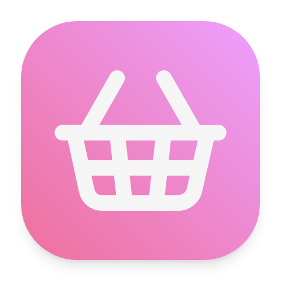
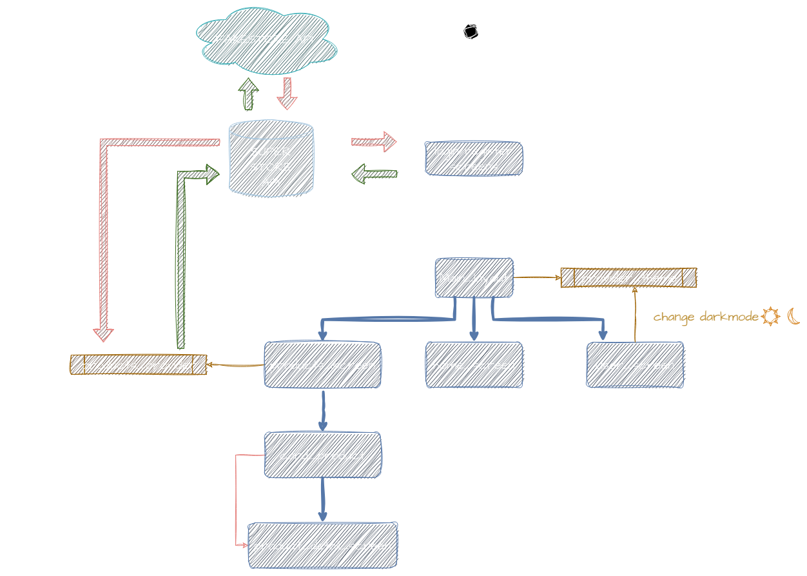

# Super Store App 

Fictional Store application that consume an API hosted on [Render.com](https://render.com/) service.



## Requirements :wrench:

* The App was tested on:
  * Google Pixel 7 Pro Device
  * Android 11
  * Android API 30
  * Flutter 3.13.9 Version
  * Dart Sdk 3.1.5 Version
## Getting Started :running:

First of all, the aplication is builded in flutter framework and it works as client of ohter project that you can see in the following url:

Super Store Backend API: [](https://github.com/camiloCanclini/canclini-express-api)

Let´s how to configurate the project!

* It´s was builded using android studio so it could be something different to execute it in others IDE. 
  
* Once you load the project and you have the dart and flutter version requiered you can run the following commands on a terminal located on the root project previously:
  ```bash
    flutter pub get
  ```
  That will download the dependencies of the project
* If everything was okey, now let's gonna set the enviroments variables. Create an `.env` file on the root project. (At the same level of the `README.md` file)
* In that file you will put the variable declarated on the `envtemplate` file.
* At this point you will need to configurate and run the backend. (`Super Store Backend`)
* When the API starts will show you the url where it is running
* That´s the url you will put on the API_URL enviroment variable
* Finally just run:
  ```bash
  flutter run
  ```


## How it works :eyes:

Next you can see a simple diagram that represents the user workflow and how internally the application requests to the API and renders the screens.



## A lot of history :sunglasses:

This was the final project of one of assiganatures that i was studied on my university and, also, it was my first application using flutter framework so... don´t wait to much :skull:. Due it is like a final exam, you could encounter the assignment on the `docs/assignament.pdf`.

I learn a lot of Dart making coding this project and I love it :heart_eyes:, So probably you could find more projects on my github account using Flutter:wink:

(I'll hope so:skull:)

Be free to download and modify it or use this repo to whatever you want. I'll hope that helps if someone is reading this.:sparkles: